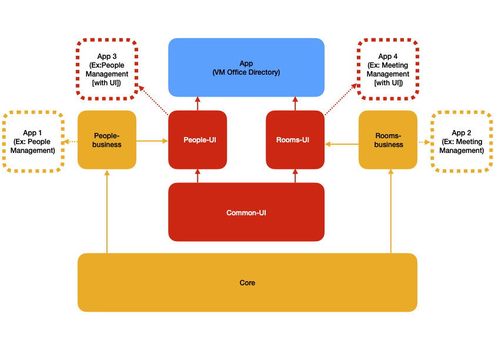
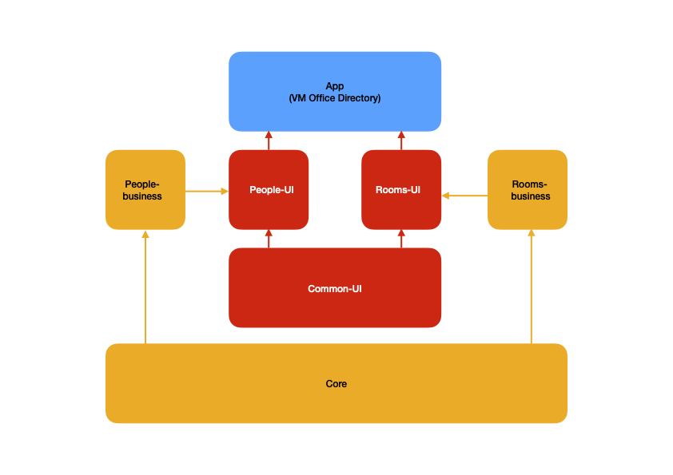
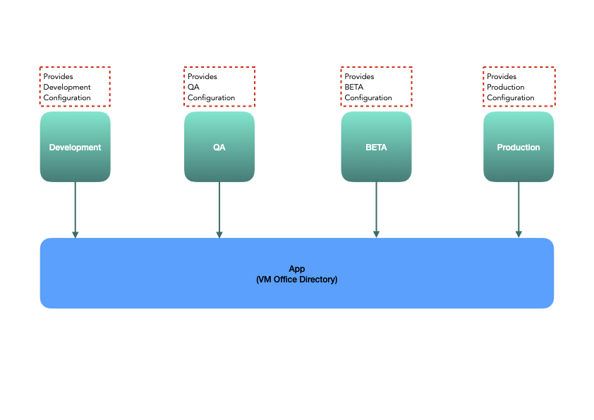
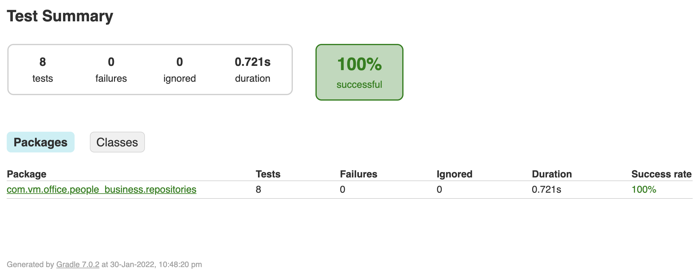
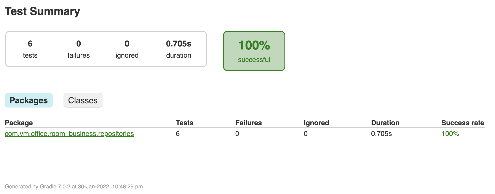
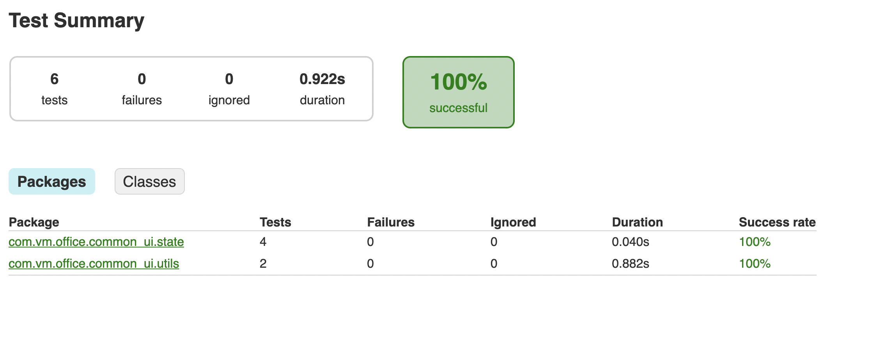
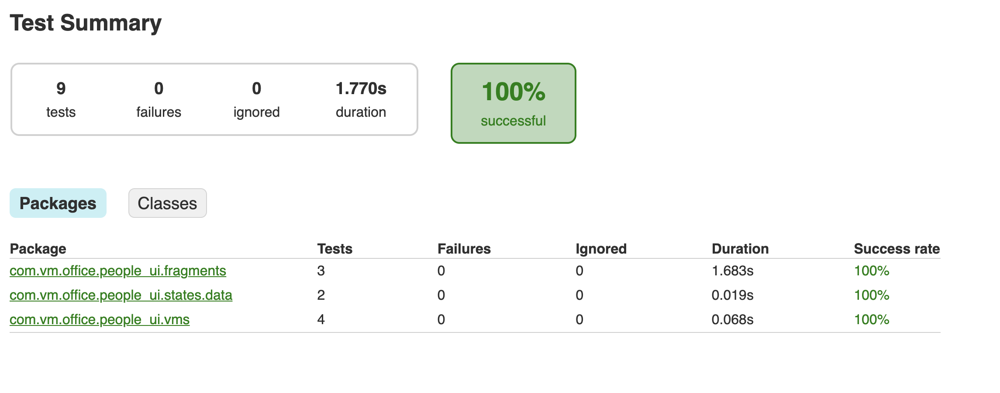
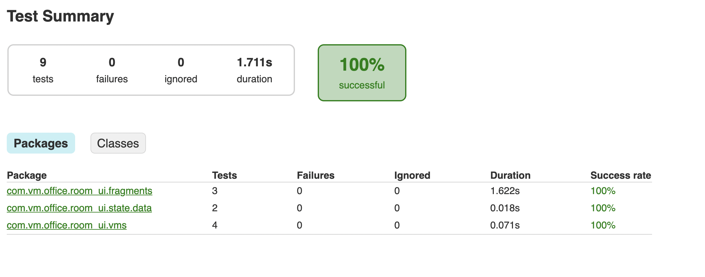

# Office Directory

## Key Points

- *MIN SDK* = 19
- *Programming Language* - Kotlin
- *Architecture* - MVVM (with JetPack - Android Arch Components)
- *Performance* 
- *Readability* 
- *Maintainability*
- *Testability* - Unit tested [Test Coverage]
- *Scalability*
- *Simplicity*
- *Accessibility*
- *Responsive [Phone & Tablet]*
- *(Various) Environment Support*
 
## Modulerization (& Reusability)

- ### Intention

- ### Current Architecture

- ### Environment Setup (current)

## Unit Tests

### Business 

#### People 

#### Room

### Common UI

### People (UI)

### Room (UI)

## Screenshots

### Phone

### Tablet

